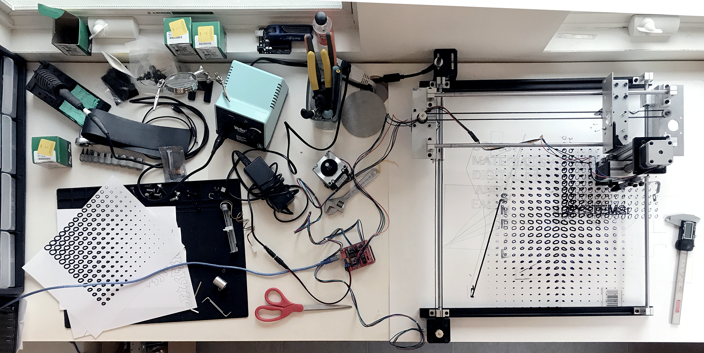

# DIYCNC
DIY CNC Kit

## Description
## Features
## Bill of Materials
|  | Item # | Item | Detailed Description  | Vendor | QTY | Cost/ Unit | Total  Cost | Link | Notes |
|-|:-:|:-:|:-:|:-:|:-:|:-:|:-:|:-:|:-:|
| Microcontroller, Drivers + Shield | 1 | Microcontroller + Acc. | ELEGOO UNO Project Basic Starter Kit with Tutorial and UNO R3 Compatible with Arduino IDE | Amazon | 1 | $17.99 | $17.99 | https://www.amazon.com/ELEGOO-Starter-Tutorial-Compatible-Official/dp/B01DGD2GAO | Critical components are the microcontroller, the programming cable, the breadboard and the jumper wires - OK to furnish these separately |
|  | 2 | CNC Driver | HiLetgo 2pcs A4988 V3 Engraver Drive Shield 3D Printer CNC Drive Expansion Board for Arduino 3D Printer CNC | Amazon | 1 | $6.79 | $6.79 | https://www.amazon.com/gp/product/B01D2HL9T8/ref=ppx_yo_dt_b_asin_title_o01_s00?ie=UTF8&psc=1 | Original version: https://www.elecrow.com/arduino-cnc-shield-v3-51-grbl-v0-9-compatible-uses-pololu-drivers.html |
|  | 3 |  | ZYAMY 30pcs 2.54mm Black Jumper Caps Standard Circuit Board Jumper Cap Shunts Short Circuit Connection Pin Blocks | Amazon | 1 | $5.08 | $5.08 | https://www.amazon.com/ZYAMY-2-54mm-Standard-Circuit-Connection/dp/B077957RN7 |  |
|  | 4 | Power Supply (motors) | LEDMO Power Supply, Transformers,LED Adapter, 12V, 5A Max, 60 Watt Max, for LED Strip | Amazon | 1 | $10.99 | $10.99 | https://www.amazon.com/LEDMO-Power-Supply-Transformers-Adapter/dp/B01461MOGQ/ref=sr_1_5?dchild=1&keywords=12v+5a+power+supply&qid=1596567642&sr=8-5 |  |
|  | 5 |  | DC Power Cable 12V 5A Plugs Male Female Connectors | Amazon | 1 | $9.89 | $9.89 | https://www.amazon.com/43x2pcs-Connectors-Security-Lighting-MILAPEAK/dp/B072BXB2Y8 |  |
|  | 6 | Motor Drivers | DRV8825 Stepper Motor Driver Module with Heat Sink | Amazon | 1 | $12.69 | $12.69 | https://www.amazon.com/DAOKI-DRV8825-Stepper-Drivers-StepStick/dp/B07X8XPCDV | Sold in packs of 5 - Original version: https://www.pololu.com/product/2982, if purchased here also needs heat sinks |
|  | 7 | Stepper Motor | STEPPERONLINE Nema 17 Stepper Motor 1.5A 12V 63.74oz.in  4-Lead 39mm Body W/ 1m Cable and Connector | Amazon | 3 | $10.50 | $31.50 | https://www.amazon.com/gp/product/B07LF898KN/ref=ppx_yo_dt_b_asin_title_o00_s00?ie=UTF8&th=1 | Original version: https://www.pololu.com/product/2267 |
|  | SUBTOTAL |  |  |  |  |  | $94.93 |  |  |
|  |  |  |  |  |  |  |  |  |  |
|  | Item # | Item | Detailed Description  | Vendor | QTY | Cost/ Unit | Total  Cost | Link | Notes |
| Timing Belt Based | 8 | Linear Guides | Horizontal Linear bearing slide set, Mergorun Horizontal 8mm Dia Linear Motion Ball Bearing Slide Bushing &500mm Linear Shaft Optical Axis with Rod Rail Support Set of 16 | Amazon | 1 | 41.99 | 41.99 | https://www.amazon.com/Horizontal-bearing-Mergorun-Bearing-Bushing/dp/B06XPFLLSK |  |
|  | 9 | Mounting Rails | 2020 V Type Aluminum Profile 500mm | Amazon | 1 | $25.99 | $25.99 | https://www.amazon.com/HFS-European-Standard-Anodized-Extrusion/dp/B083B9F89G | Only two rails needed for construction of kit (additl rails can be used for machine prototyping, or the pack can be split with a roommate etc.) |
|  | 10 | Timing Belt Hardware | KeeYees 5M GT2 Timing Belt + Accessories | Amazon | 1 | $14.99 | $14.99 | https://www.amazon.com/KeeYees-Timing-Tensioner-Torsion-Printer/dp/B07JKT5BZQ/ |  |
|  | 11 | Motor Mounts | Onyehn 5Pcs Nema 17 Stepper Motor Mounting Bracket with M3 Screws Nuts 5 Pack | Amazon | 1 | 13.99 | 13.99 | https://www.amazon.com/gp/product/B07D7P2DC3 |  |
|  | 12 | Bolts | M4 x 8mm/10mm/12mm/14mm/16mm 12.9 Grade Alloy Steel Hex Socket Head Cap Screws Assortment | Amazon | 1 | $8.99 | $8.99 | https://www.amazon.com/iExcell-Assortment-Socket-Screws-Finish/dp/B01M3SSEG2 |  |
|  | 13 |  | M3 x 6 | McMaster | 12 | $0.09 | $1.12 | https://www.mcmaster.com/91290A111/ |  |
|  | 14 |  | M3 x 8 | McMaster | 6 | $0.08 | $0.47 | https://www.mcmaster.com/91290A113/ |  |
|  | 15 | Shoulder Screws | m4 5x20mm, 9mm thread | McMaster | 2 | $2.96 | $5.92 | https://www.mcmaster.com/92981A042/ |  |
|  | 16 | Nuts | m3 | McMaster | 4 | $0.01 | $0.04 | https://www.mcmaster.com/90592A085/ |  |
|  | 17 |  | m4 | McMaster | 12 | $0.01 | $0.17 | https://www.mcmaster.com/90592A090/ |  |
|  | 18 | T-Nuts | m3 | Amazon | 2 | $0.16 | $0.32 | www.amazon.com/dp/B01GCDG2QE |  |
|  | 19 |  | m4 | Amazon | 10 | $0.16 | $1.60 | https://www.amazon.com/dp/B01GCDG2RI?th=1 |  |
|  | SUBTOTAL |  |  |  |  |  | $115.58 |  |  |
| Subtotal |  |  | Microcontroller, Drivers + Shield |  | 1 | $94.93 | $94.93 |  | Minimum Electronic Components for 3-axis Machine |
|  |  |  | Timing-Belt Based CNC Hardware |  | 1 | $115.58 | $115.58 |  | Custom Bracket NIC |
|  |  |  | Total Required Kit Cost/Student |  |  |  | $210.51 |  |  |
## Programming and Assembly
The following resources outline some of the steps needed to program and assemble the various components needed to send GCode to the machine: 
##### GRBL
grbl is a GCode interpreter for the Aruduino IDE
https://github.com/grbl/grbl/wiki - The DIY CNC uses an older version of the grbl software as compatible hardware is less expensive and more readily available.
https://github.com/grbl/grbl/wiki/Compiling-Grbl - compiling instructions
##### DRV8825 Stepper Driver
https://www.youtube.com/watch?v=89BHS9hfSUk&feature=youtu.be - This online tutorial by Pololu (the manufacturer of the DRV8825 driver) details the process for setting the current limit on the DRV8825 stepper driver. 
##### CNC Shield
https://blog.protoneer.co.nz/arduino-cnc-shield-v3-00-assembly-guide/ - Protoneer designed the CNC shield used in the project. The BoM includes an inexpensive copy for cost and speed of shipment.
https://www.handsontec.com/dataspecs/module/cnc-3axis-shield.pdf - Specs the shield in the BoM
## Acknowledgements
The DIY CNC kit and associated documentation was created for the Fall 2020 edition of *Material Systems: Digital Design and Fabrication*, a course taught at the Harvard University Graduate School of Design by Nathan King and Zach Seibold, and TA'ed by Erin Hunt.  Burton Legeyt contributed to the design and production of the custom aluminum mounting brackets. More information regarding the course and the associated student projects can be found at the links below: 
https://www.gsd.harvard.edu/course/material-systems-digital-design-and-fabrication-fall-2020/
http://sci6317.online
## References
